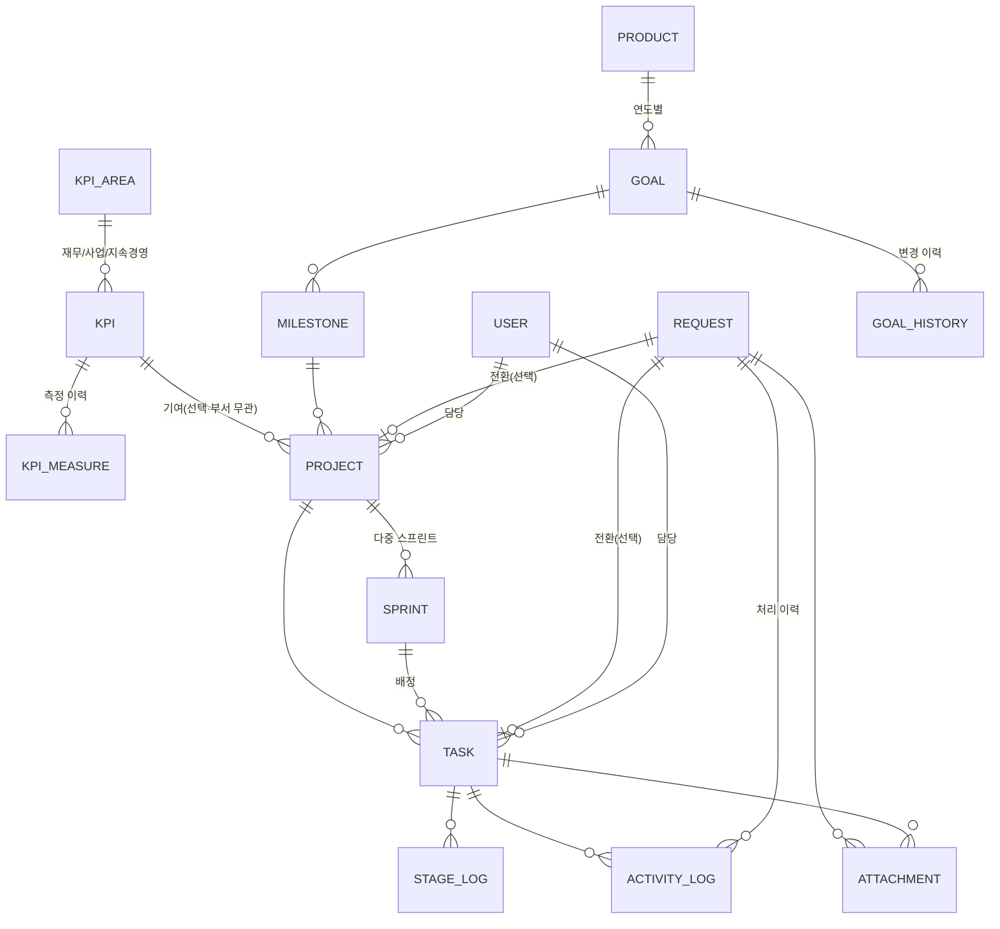

# 02. 데이터 모델

## 1. ERD 개요



## 2. 엔티티 정의

### 2.1 Product (부문)
| 필드 | 타입 | 설명 |
|---|---|---|
| id | PK | |
| name | varchar | Sales / Finance / Marketing / Product Planning / Service (추가 가능) |
| owner_id | FK→User | 부문 오너 |
| description | text | 부문이 추구하는 방향 한 문단 |
| created_at, updated_at | timestamptz | |

### 2.2 Goal (부문별 연간 목표)
| 필드 | 타입 | 설명 |
|---|---|---|
| id | PK | |
| product_id | FK→Product | |
| year | int | 대상 연도 |
| statement | text | Goal 문장. 초안 단계에서는 방향 문장만 |
| kpi | text (nullable) | 측정 지표. 미정이면 null 허용 |
| status | enum | `draft` 초안 / `shaping` 구체화중 / `fixed` 확정 |
| owner_id | FK→User | |
- 제약: (product_id, year) unique
- 모든 UPDATE는 `goal_history`(goal_id, changed_by, changed_at, diff, reason)에 기록

### 2.2a KPI (전사 측정 지표)

**전사 KPI는 부문(Product) 소속이 아니라 영역(재무/사업/지속경영) 소속이다.**
어느 부서의 프로젝트든 KPI에 연결할 수 있어, 부서간 협업이 필요한 KPI는
여러 Product의 마일스톤·프로젝트가 결합되어 결과를 만든다.

**KPI 카탈로그는 트윈(digitaltwin.retail.vehicle)의 실질 KPI 트리를 이식한 것이다.**
정본: 트윈 저장소 `data/governance/ceo_tree.csv` — 3영역(재무 37/사업 35/지속경영 25)
× 14 KPI(ASP, 경상이익률, 합산손익(률), 도매판매량, SUV 육성, 시장점유율, 친환경,
그린워싱, Full SI 2.0, 고객만족도 서비스/판매, 보안, 브랜드트래커) × 하위 드라이버
노드. 코드는 트윈 node_id(`KPI-ASP`, `ND-ASP-INC`…)를 유지해 정본과 1:1 대조 가능하며,
트윈의 `bind`(실측 바인딩) 키는 source 필드에 표기된다(빈값=미연동 — 트윈의
"데이터 수집 프로젝트 신설 대상" 규약 그대로). **이 실질 KPI들을 기반으로 하위
프로젝트가 생성·연결된다.** 수동 추가 KPI는 `Kn` 시퀀스(meta.kpiSeq)로 채번.

**AI/Data 과제 지표(K1~K7)도 실질 KPI 하위에 매칭된다** — 최상위에 따로 두지 않는다.
K1 월 결산 소요일→경상이익률(재무 운영), K2 수주 예측 오차→도매판매량(수요 예측),
K3 리드 스코어링→시장점유율(영업 전환), K4·K5 캠페인 지표→브랜드트래커(마케팅 효율),
K6·K7→고객만족도 서비스(서비스). **계층 체인: 영역 → KPI → 하위 지표 → 프로젝트
(기여 유형) → 스프린트 → 태스크** — KPI 모니터링 화면에서 끊김 없이 확인된다.

| 필드 | 타입 | 설명 |
|---|---|---|
| code | varchar | 전사 스코프 자동 채번 `K1`, `K2`… (최대 번호+1 — 삭제와 충돌 방지) |
| area | enum | `재무` / `사업` / `지속경영` |
| name | varchar | 지표명 (예: "고객만족", "분기 수주 예측 오차") |
| unit | varchar | %, 일, 건/천대 등 표시 단위 |
| direction | enum | `+` 높을수록 좋음 / `-` 낮을수록 좋음 / `~` 목표에 근접 |
| target | number (nullable) | 목표값. **미정(null) 허용** — 미측정 상태로 관리 |
| weight | number (default 1) | 영역 롤업 가중치 |
| source | varchar | **데이터 소스(수집 시스템)** — 빈 값 = 미연동 |
| measures | array | 측정 이력 `{at, value, note}` — 최신 값이 실적 |
| subs | array | **하위 지표** — 아래 구조. 있으면 KPI 달성률 = 하위 지표 가중 롤업 |

**하위 지표 (subs[]) — KPI를 정량 지표로 분해**
(예: 고객만족 → 품질: 12V 배터리 방전 건수·DTC(MIL ON) 발생률 / 서비스: 즉시
예약 가능률·평균 수리시간 / 고객케어: 앱 평점)

| 필드 | 설명 |
|---|---|
| code | `K8-1` 형식 (상위 코드-순번, 최대 번호+1) |
| group | 분류 라벨 (품질/서비스/고객케어 등 자유 텍스트) |
| name, unit, direction, target, weight, source, measures | KPI와 동일 의미. weight는 상위 KPI 내 롤업 가중치 |

**데이터 연동 원칙 (파생 상태 dataState)**
- 모든 지표(leaf)는 실제 시스템에서 수집된 데이터와 연동하는 것이 원칙이다.
- `linked` — source 명시(수집 시스템 존재) / `in_progress` — 미연동이지만 기여 유형
  `연동`인 프로젝트가 진행중 / `unlinked` — 둘 다 없음 → **데이터 연동 프로젝트가
  필수로 이어져야 하는 상태**. 관리 배너에 노출되고 배지 클릭 시 연동 프로젝트
  생성 동선(`projects.html?kpi=…&role=연동`)으로 연결된다.

**파생값 (서버 계산, 저장하지 않음)**
- 달성률 = 방향 반영: `+` → 실적/목표, `-` → 목표/실적, `~` → 1-|실적-목표|/목표. 0~1.3 클램프
- 신호등: 달성률 ≥98% `달성` / ≥92% `주의` / 미만 `위험` / 측정·목표 없음 `미측정`
- 하위 지표가 있는 KPI: **KPI 자체 실측이 우선**(트윈 방식 — 하위 노드는 드라이버),
  자체 실측이 없으면 측정된 하위 지표의 가중 롤업(`rollup=true`)을 폴백으로 사용
- 영역 점수 = **측정된 KPI만** 가중 평균. 미측정 지표는 제외하고 커버리지(측정 n/전체 m)로 별도 표시
- KPI별 기여 프로젝트·태스크 집계는 **부서 불문·하위 지표 포함** (`depts`에 참여 부서 목록)
- 프로젝트 미연결·데이터 미연동 지표는 1급 관리 대상 — KPI 모니터링 화면 배너에 노출
- **상충 감시(가드레일)**: 지표별 `sideEffects` = 이 지표에 영향(impacts)을 선언한 외부
  프로젝트 목록, `conflicts` = 그중 진행중·계획 상태의 부정(−) 영향 수. KPI는 단순히
  숫자만 올릴 수 없다 — 개선 액션의 대가(이익·타 지표 하락)를 함께 판단한다

### 2.3 Milestone
| 필드 | 타입 | 설명 |
|---|---|---|
| id | PK | |
| goal_id | FK→Goal | |
| title | varchar | 예: "M2. 수주 파이프라인 예측 모델" |
| due_quarter | varchar | 2026-Q3 형식 |
| status | enum | `planned` / `in_progress` / `done` / `dropped` |
| sort_order | int | |

### 2.4 Project
| 필드 | 타입 | 설명 |
|---|---|---|
| id | PK | 표시 코드 `PRJ-###` 자동 채번 |
| milestone_id | FK→Milestone | 필수 — 프로젝트는 반드시 마일스톤에 연결 |
| kpi_code | FK→KPI/하위 지표 (nullable) | 기여 전사 KPI 또는 하위 지표 — **부서 무관** 연결. 연결 시 태스크 진행이 지표별로 집계됨 |
| kpi_role | enum (nullable) | 기여 유형: `개선`(액션 부서가 수치를 개선) / `연동`(수집 시스템 데이터 연결) |
| impacts | array | **사이드 이펙트 선언** `{kpi, effect(+/−), note}[]` — 이 프로젝트가 기여 지표 외 다른 지표에 미치는 영향 (예: OTA 확대 → 영업이익률 −). 영향받는 지표에는 상충 감시(⇄) 배지·가드레일 뷰로 표시 |
| name | varchar | |
| owner_id | FK→User | 담당자 (필수) |
| priority | enum | `P0` / `P1` / `P2` / `P3` |
| status | enum | `planned` 계획 / `active` 진행중 / `on_hold` 보류 / `done` 완료 / `cancelled` |
| start_date, target_end_date | date | 보류 시 target_end_date null 허용 |
| purpose | text | 목적/기대 Deliverable |
| origin_request_id | FK→Request (nullable) | 요청에서 전환된 경우 |
- progress(진행률)는 저장하지 않고 태스크 완료 수로 파생 계산

### 2.5 Sprint
| 필드 | 타입 | 설명 |
|---|---|---|
| id | PK | |
| project_id | FK→Project | **스프린트는 프로젝트에 속한다** — 1개 프로젝트는 다수의 스프린트를 가진다 |
| name | varchar | `Sprint 2026-17` (ISO 주차 기반, 프로젝트 스코프 채번) |
| start_date, end_date | date | 기본 2주 (시작일+10영업일 자동 제안) |
| status | enum | `planned` / `active` / `closed` |
| retro_note | text (nullable) | 종료 시 회고 메모 |
- 프로젝트당 `active` 스프린트는 최대 1개 (BR로 강제)
- 기간·상태 변경은 사유와 함께 `sprint_history`에 기록. `closed` 후에는 수정 불가
- 종료 시 미완료 태스크는 이월(같은 프로젝트의 다음 스프린트/백로그) 처리 — Task.carry_over_count 증가

### 2.6 Task
| 필드 | 타입 | 설명 |
|---|---|---|
| id | PK | 표시 코드 `DT-###` 자동 채번 (Git 연동 키) |
| project_id | FK→Project | 필수 |
| sprint_id | FK→Sprint (nullable) | null = 백로그 |
| title | varchar | |
| assignee_id | FK→User | 필수 |
| reviewer_id | FK→User (nullable) | |
| current_stage | enum | 아래 Stage enum |
| status | enum | `todo` / `in_progress` / `done` / `cancelled` |
| start_date, target_end_date | date | 필수 |
| deliverable | text | **필수** — 완료 판단 기준 산출물 |
| git_branch | varchar | `feature/DT-<id>-<slug>` 자동 제안 |
| carry_over_count | int (default 0) | 스프린트 이월 횟수 — 반복 이월 추적 |
| origin_request_id | FK→Request (nullable) | |

**Stage enum (순서 고정):**
`intake`(Intake 협의) → `data_prep`(데이터 준비) → `eda`(EDA) →
`modeling`(모델링) → `pipeline`(파이프라인) → `service_dev`(서비스 개발)

단계는 앞으로만 이동하는 것이 기본이며, 되돌림(rollback)은 사유 입력 시 허용하고
StageLog에 별도 이벤트로 남긴다. 성격상 불필요한 단계는 `skipped` 처리 가능
(예: 집계성 과제는 모델링 생략) — 생략도 StageLog에 기록.

### 2.7 StageLog (단계 이력 — 소요시간 분석의 원천)
| 필드 | 타입 | 설명 |
|---|---|---|
| id | PK | |
| task_id | FK→Task | |
| stage | enum | |
| event | enum | `entered` / `completed` / `skipped` / `rolled_back` |
| occurred_at | timestamptz | |
| actor_id | FK→User | |
| note | text | 단계 완료 시 산출물 요약 등 |
- 단계 소요시간 = 같은 stage의 `entered` ~ `completed` 간격 (영업일 환산)

### 2.8 ActivityLog (통합 활동 로그)
| 필드 | 타입 | 설명 |
|---|---|---|
| id | PK | |
| parent_type / parent_id | polymorphic | `task` 또는 `request` — 태스크 활동 로그와 요청 처리 이력을 한 구조로 관리 |
| type | enum | `git_commit` / `manual` / `stage_change` / `request_reply` / `status_change` / `system` |
| actor_id | FK→User (nullable) | git은 커밋 author 매핑 |
| body | text | 수동 로그 본문 또는 커밋 메시지 |
| git_hash, git_branch | varchar (nullable) | type=git_commit일 때 |
| occurred_at | timestamptz | |
- `stage_change`, `request_reply`는 StageLog/Request에서 이벤트 발생 시 자동 생성
  (타임라인 화면은 이 테이블 하나만 조회)

### 2.9 Request (요청 Intake)
| 필드 | 타입 | 설명 |
|---|---|---|
| id | PK | 표시 코드 `REQ-<년도>-###` |
| title | varchar | |
| channel | enum | `email` / `phone` / `meeting` / `form`(요청서) / `etc` |
| requester_name, requester_org | varchar | 사내 조직/직책 텍스트 |
| received_at | timestamptz | 접수 일시 (필수) |
| product_id | FK→Product (nullable) | 미정 허용 |
| summary | text | 전화/회의는 요약 필수, 이메일은 원문 첨부로 대체 가능 |
| status | enum | `received` 접수 / `reviewing` 검토중 / `converted` 전환됨 / `returned` 리턴 완료 / `rejected` 반려 |
| resolution | enum (nullable) | `simple_return` / `to_task` / `to_project` / `to_product` |
| converted_task_id / converted_project_id | FK (nullable) | 전환 결과 연결 |
| returned_at | timestamptz (nullable) | 최종 리턴 일시 |
| return_note | text | 회신 방법·내용 요약 |
- **처리 소요시간 = returned_at − received_at** (단순 리턴 업무량 측정의 핵심)
- 중간 회신은 ActivityLog(type=`request_reply`)로 기록

### 2.10 Attachment
| 필드 | 타입 | 설명 |
|---|---|---|
| id | PK | |
| parent_type / parent_id | polymorphic | request / task / activity_log |
| filename, mime, size | | .eml, .pdf, .xlsx 등 |
| storage_key | varchar | 오브젝트 스토리지 키 |
| uploaded_by, uploaded_at | | |

### 2.11 User
기존 서비스의 사용자 계정을 그대로 사용한다 (신규 테이블 없음, FK만 참조).
git author email ↔ 사용자 매핑 테이블(`user_git_identity`)만 추가.

## 3. 상태 머신

### Task 단계
```
intake → data_prep → eda → modeling → pipeline → service_dev → (task.status = done)
   └────── 각 단계에서 skipped 가능 (사유 필수) ──────┘
```

### Request
```
received → reviewing → converted (to_task | to_project | to_product)
                    └→ returned (simple_return, returned_at 기록)
                    └→ rejected (사유 필수)
```
converted 된 요청도 연결 태스크가 완료되면 **최종 리턴 여부**를 물어
returned_at을 기록한다 (요청자에게 결과를 돌려줬는가를 끝까지 추적).

## 4. Git 로깅 규약

| 항목 | 규약 |
|---|---|
| 브랜치 | `feature/DT-<태스크번호>-<slug>` (태스크 생성 시 자동 제안) |
| 커밋 메시지 | `[DT-<번호>] <내용>` — 이 패턴이 있으면 해당 태스크에 자동 연결 |
| 연동 방식 | Git 서버(예: GitHub/GitLab) push webhook → 백엔드가 메시지 파싱 → ActivityLog(type=git_commit) 생성 |
| 미매칭 커밋 | 패턴 없는 커밋은 무시 (강제하지 않되, 자동화율 지표로 관찰) |
| author 매핑 | commit author email → user_git_identity 로 사용자 식별, 미등록 이메일은 "미매핑" 표시 |

## 5. 집계 뷰 (대시보드 원천)

| 뷰 | 정의 |
|---|---|
| v_stage_duration | StageLog에서 단계별 entered→completed 영업일. 최근 90일 완료분 평균/표본수 |
| v_bottleneck_tasks | 현재 단계 체류일 > 해당 단계 평균 × 1.5 인 진행중 태스크 |
| v_product_project_status | 부문 × 프로젝트 상태 카운트 |
| v_request_throughput | 채널별 접수/리턴 건수, 평균 처리 소요, 대기 경과 |
| v_sprint_summary | 스프린트별 완료율(완료 태스크/전체) |
